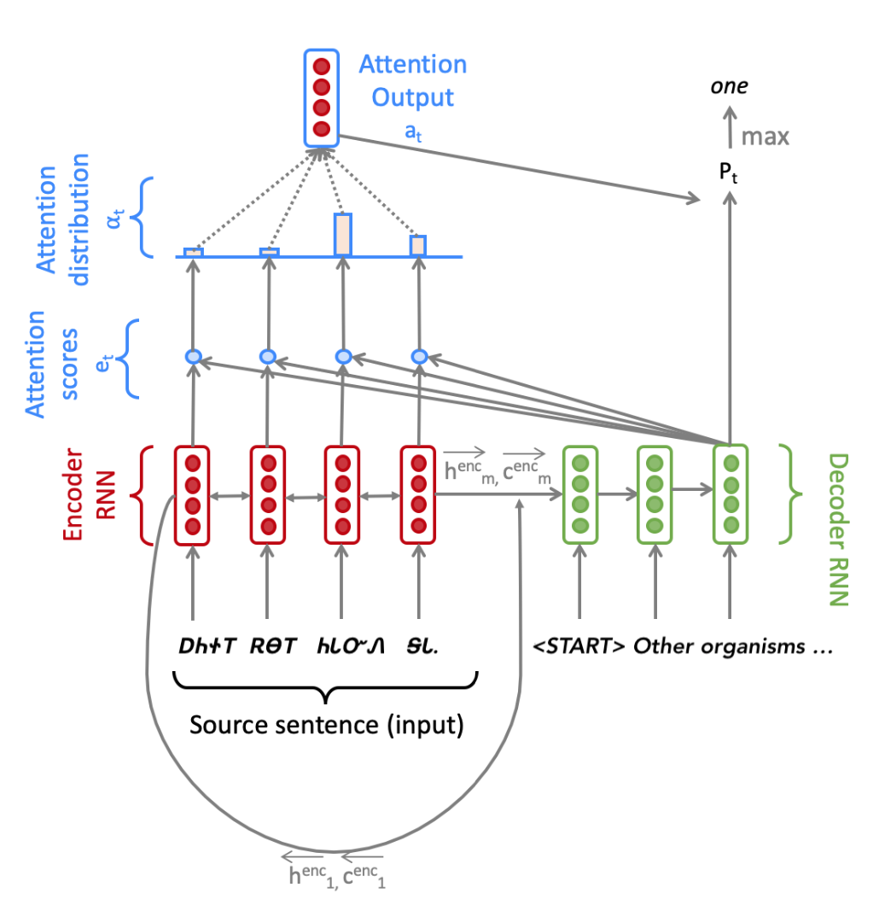

# Neural Machine Translation Using PyTorch

## Introduction
This repository contains a PyTorch implementation of a Neural Machine Translation (NMT) model. The model uses a Bidirectional LSTM Encoder and a Unidirectional LSTM Decoder, forming a sequence-to-sequence model with an attention mechanism. The goal is to translate the Cherokee language to English. The model is trained on data provided by Stanford's [CS224n course](https://web.stanford.edu/class/cs224n/) as part of Assignment 4. Cherokee is an ancient, low-resource language, and the dataset size is around ~16k samples. While the model is not expected to perform exceptionally due to the limited data, it serves as a good exercise for understanding the workings of an NMT model, with the added benefit of faster training times.

<!-- Insert an image diagram.png wih caption 'Seq2Seq Model with Multiplicative Attention'-->

*Figure: The Seq2Seq Model with Multiplicative Attention, shown on the third step of the decoder. A detailed explanation of the model is given in the [NMT_PyTorch.pdf]("./NMT_PyTorch.pdf") file.*

## Requirements
- Python 3.7
- PyTorch 1.8.1
- docopt 0.6.2
- nltk 3.7
- sentencepiece 0.1.99
- sacrebleu 2.4.0
- tensorboard 2.11.2
- tqdm 4.64.1

## Usage

### Preprocessing
To generate the `vocab.json` file, run the following command:

```
python3 vocab.py --train-src=./chr_en_data/train.chr --train-tgt=./chr_en_data/train.en vocab.json
```

### Training
To train the model, run the following command:

```
CUDA_VISIBLE_DEVICES=0 python3 run.py train --train-src=./chr_en_data/train.chr --train-tgt=./chr_en_data/train.en --dev-src=./chr_en_data/dev.chr --dev-tgt=./chr_en_data/dev.en --vocab=vocab.json --cuda --lr=5e-4 --patience=1 --valid-niter=200 --batch-size=32 --dropout=.3
```

### Testing
To test the model, run the following command:
```
CUDA_VISIBLE_DEVICES=0 python3 run.py decode model.bin ./chr_en_data/test.chr ./chr_en_data/test.en outputs/test_outputs.txt --cuda
```